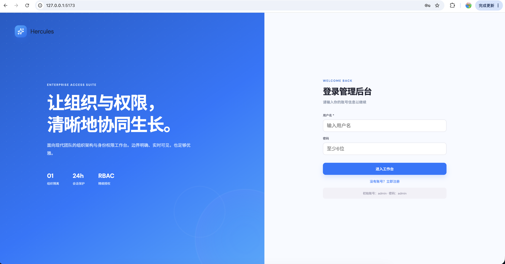
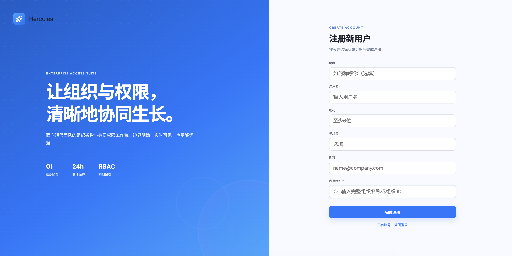
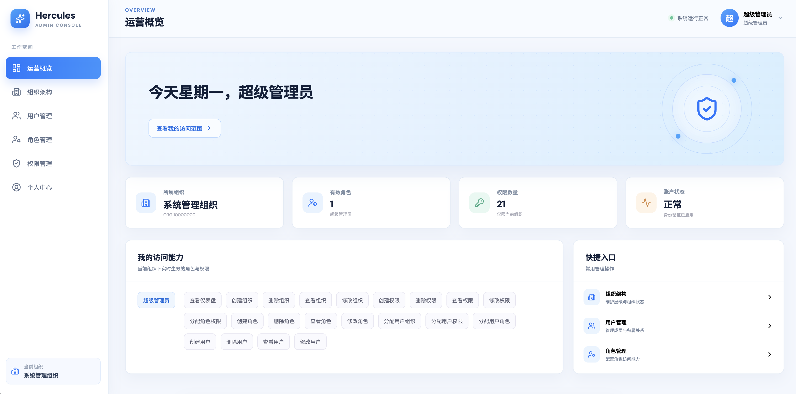
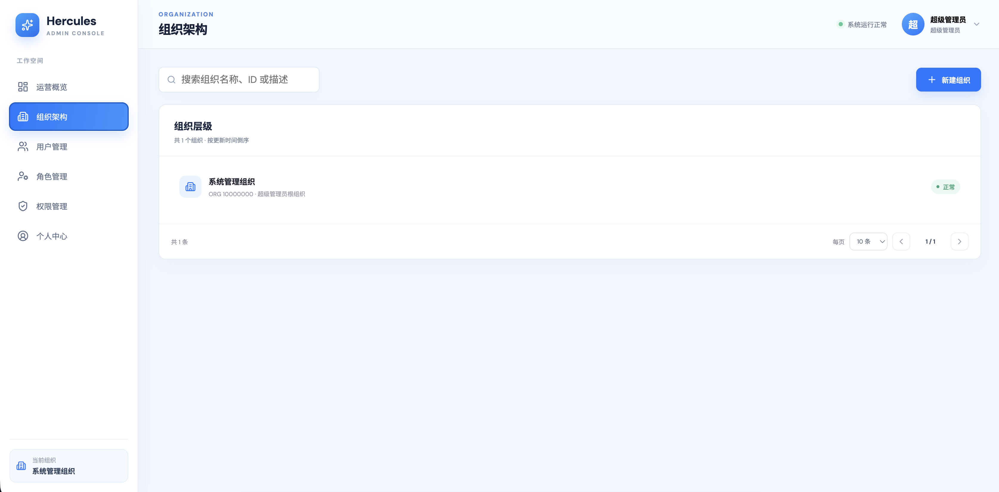
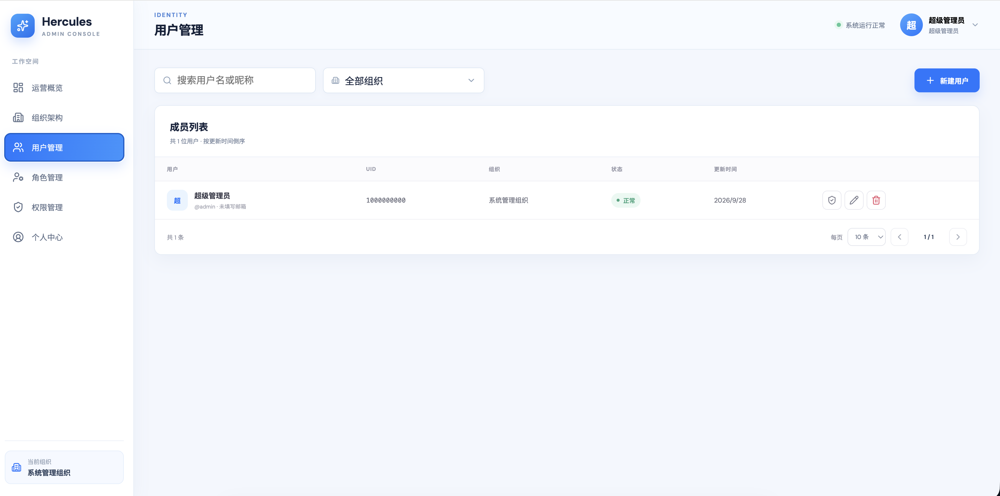
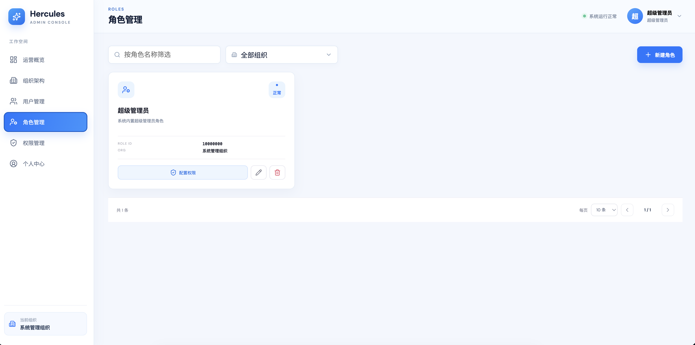
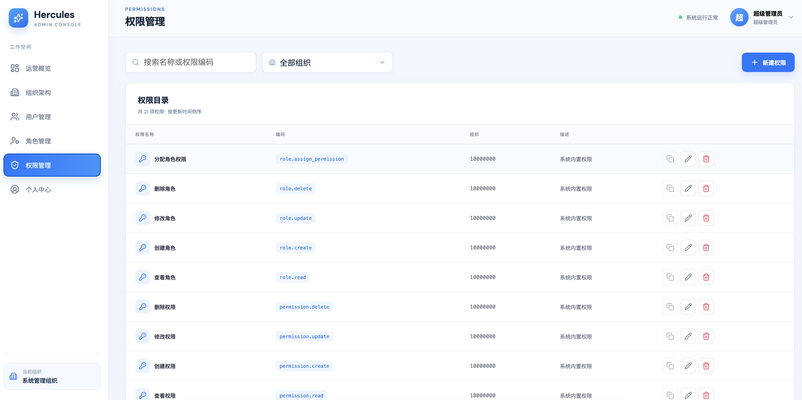
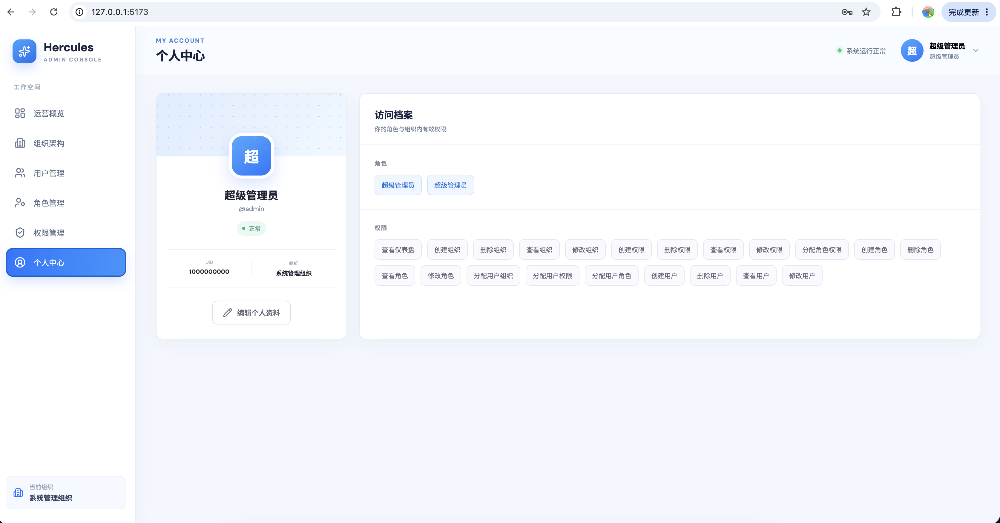

# Hercules Admin

Hercules Admin 是一个基于 GoFrame v2、MySQL 8 和 React 构建的组织级后台管理系统。系统提供组织树、用户、角色、权限、登录注册、个人资料和完整的 RBAC 管理能力，并在所有权限判断中执行组织隔离。

## 项目结构

```text
admin
├── admin-web
│   ├── public
│   ├── src
│   │   ├── api.ts
│   │   ├── App.tsx
│   │   ├── main.tsx
│   │   ├── styles.css
│   │   └── types.ts
│   ├── package.json
│   └── README.md
├── admin
│   ├── cmd/server
│   ├── config
│   ├── internal
│   │   ├── bootstrap
│   │   ├── consts
│   │   ├── config
│   │   ├── controller
│   │   ├── middleware
│   │   ├── model
│   │   ├── repository
│   │   └── service
│   ├── pkg
│   ├── resource/migrations
│   ├── go.mod
│   └── README.md
├── scripts/run.sh
├── docker-compose.yaml
└── README.md
```

## 核心设计

- `organization.parent_id` 保存直接上级组织的数据库主键 `organization.id`；根组织为 `NULL`。
- `user.org_id`、`permission.org_id`、`role.org_id` 保存组织业务 ID。
- 新建用户、组织、角色时不接收业务 ID，由后端分别生成 10 位 `uid`、8 位 `org_id` 和全局唯一
  `role_id`；超级管理员继续使用需求指定的固定 ID。
- 管理员新建用户时密码可留空，后端会生成 16 位随机初始密码，并且只在创建成功响应中明文返回一次。
- 权限编码使用 `report.read` 形式的小写点分格式；权限编码、权限名称和角色名称均在组织内唯一。
- 权限只在用户当前组织内生效。关联查询同时校验角色和权限的 `org_id`，不继承父组织或子组织权限。
- 普通管理员只能管理自己组织的数据；超级管理员可跨组织管理。跨组织移动用户仅限超级管理员。
- 用户直接权限通过隐藏的个人角色实现，仍然落在需求指定的 `user_role` 和 `role_permission` 表中。
- 状态在数据库中保存为 `INT`：`1` 表示正常、`2` 表示禁用；接口返回 `normal` 或 `disabled`。
- 所有更新使用 `version` 乐观锁。删除组织前会检查子组织、用户、角色和权限，避免产生悬挂关系。
- 数据库不使用外键，关联完整性由事务和业务层校验。

## 数据库表结构

初始化 SQL 位于 [`admin/resource/migrations/001_init.sql`](./admin/resource/migrations/001_init.sql)。所有表均包含自增主键、唯一业务标识、`extra`、`version`、毫秒级创建时间和更新时间。

### organization

| 字段 | 类型 | 说明 |
| --- | --- | --- |
| id | BIGINT | 自增主键 |
| org_id | BIGINT | 组织业务 ID，唯一，最多 8 位 |
| name | VARCHAR(100) | 组织名称 |
| parent_id | BIGINT NULL | 直接上级组织的 `id` |
| description | VARCHAR(500) | 描述 |
| status | INT | 1 正常、2 禁用 |
| extra | JSON | 扩展数据 |
| version | INT | 乐观锁版本 |
| created_at / updated_at | DATETIME(3) | 创建/更新时间 |

### user

包含 `id`、全局唯一 `uid`、`username`、`nickname`、`phone_num`、`email`、bcrypt `password`、`org_id`、`status`、`extra`、`version`、`created_at`、`updated_at`。用户名全局唯一。

### permission

包含 `id`、`code`、`name`、`description`、`org_id`、`extra`、`version`、`created_at`、`updated_at`。`(org_id, code)` 与 `(org_id, name)` 均唯一。

### role

包含 `id`、`role_id`、`name`、`description`、`org_id`、`extra`、`version`、`created_at`、`updated_at`。由于关联表按 `role_id` 关联，`role_id` 全局唯一；组织内角色名唯一。

### user_role

包含 `id`、`uid`、`role_id`、`extra`、`version`、`created_at`、`updated_at`。不再设置单独的业务 ID，使用 `(uid, role_id)` 唯一确认一条关联记录。

### role_permission

包含 `id`、`role_id`、`permission_code`、`extra`、`version`、`created_at`、`updated_at`。不再设置单独的业务 ID，使用 `(role_id, permission_code)` 唯一确认一条关联记录。

## 快速开始

### 一键启动全部服务

`docker-compose.yaml` 同时定义了 MySQL、Go 后端和 React/Nginx 前端。推荐使用统一脚本：

```bash
cp .env.example .env
./scripts/run.sh start
```

超级管理员默认用户名及密码: admin/admin；
登陆系统后可创建用户及密码，之后新建用户可用用户名及密码登陆；创建组织后也可进行新用户注册。

如下图所示是超级管理员登录后页面截图：


















启动完成后访问：

- 管理台：`http://127.0.0.1:5173`
- 后端 API：`http://127.0.0.1:8000`
- Swagger：`http://127.0.0.1:8000/swagger/`
- MySQL：`127.0.0.1:3306`

统一脚本支持：

```bash
./scripts/run.sh start
./scripts/run.sh stop
./scripts/run.sh restart
./scripts/run.sh build
./scripts/run.sh logs admin
./scripts/run.sh status
```

### 本地开发模式

### 1. 启动 MySQL

```bash
docker compose -f docker-compose.yaml up -d --wait mysql
```

默认连接信息：

- 地址：`127.0.0.1:3306`
- 数据库：`hercules_admin`
- 用户名：`hercules`
- 密码：`hercules`
- Root 密码：`root`

### 2. 启动后端

```bash
cd admin
go mod download
go run ./cmd/server
```

后端监听 `http://127.0.0.1:8000`，健康检查为 `GET /api/health`，Swagger UI 为 `http://127.0.0.1:8000/swagger/`。

### 3. 启动前端

```bash
cd admin-web
npm install
npm run dev
```

浏览器打开 `http://127.0.0.1:5173`。Vite 会将 `/api` 代理到后端。

## 多环境配置

后端配置位于 `admin/config`：

| 文件 | APP_ENV | 用途 |
| --- | --- | --- |
| `config.yaml` | `default` | 默认基础配置 |
| `config.dev.yaml` | `dev` | 本地开发配置 |
| `config.test.yaml` | `test` | 自动化测试配置 |
| `config.prod.yaml` | `prod` | Compose/生产部署配置 |

未设置 `APP_ENV` 时默认使用 `dev`。示例：

```bash
APP_ENV=test go run ./cmd/server
APP_ENV=prod JWT_SECRET='replace-me' go run ./cmd/server
```

Compose 中后端固定使用 `APP_ENV=prod`，数据库 DSN 和 JWT 密钥可以通过 `.env` 覆盖。
测试流水线可设置 `DATABASE_DSN`，将 `config.test.yaml` 指向独立的测试数据库。

## 接口响应

所有接口统一返回三个字段：

```json
{
  "code": 0,
  "message": "success",
  "data": {}
}
```

- `code`：`int`，成功为 `0`，失败使用对应 HTTP 状态整数。
- `message`：`string`，接口结果说明。
- `data`：`any`，业务数据；没有业务数据时为 `null`。

## 初始超级管理员

后端首次启动时会幂等创建：

| 属性 | 值 |
| --- | --- |
| 用户名 | `admin` |
| 密码 | `admin` |
| UID | `1000000000` |
| Org ID | `10000000` |

超级管理员绕过普通组织范围限制并拥有全部系统管理能力。首次登录后请立即修改密码，并在生产环境通过 `.env` 设置 JWT 密钥与数据库密码。

## 主要 API

| 能力 | 接口 |
| --- | --- |
| 登录 / 注册 | `POST /api/auth/login`、`POST /api/auth/register` |
| 注册组织精确搜索 | `GET /api/public/organizations/search?q=` |
| 当前用户 | `GET /api/me`、`PUT /api/me` |
| 访问验证 | `GET /api/access/check?permission=&role_id=&org_id=` |
| 组织 | `GET /api/organizations`、`GET /api/organizations/tree`、`POST/PUT/DELETE /api/organizations` |
| 用户 | `GET/POST/PUT/DELETE /api/users` |
| 用户分配 | `PUT /api/users/:uid/roles`、`permissions`、`organization` |
| 权限 | `GET/POST/PUT/DELETE /api/permissions` |
| 角色 | `GET/POST/PUT/DELETE /api/roles` |
| 角色权限 | `PUT /api/roles/:orgId/:roleId/permissions` |

除健康检查、登录、注册和组织搜索外，接口均要求 `Authorization: Bearer <token>`。

组织、用户、角色和权限管理列表统一支持服务端分页，响应 `data` 格式如下：

```json
{
  "list": [],
  "total": 0,
  "page": 1,
  "page_size": 10
}
```

分页参数为 `page` 和 `page_size`，默认值分别为 `1` 和 `10`，`page_size` 最大为 `1000`。
所有管理列表均按 `updated_at DESC` 排序，并使用主键倒序作为更新时间相同时的稳定排序条件。

分页列表支持服务端关键词搜索：

- `GET /api/organizations?q=&page=&page_size=`：按组织名称、组织 ID 或描述搜索。
- `GET /api/users?q=&org_id=&page=&page_size=`：按用户名或昵称搜索，可按组织筛选。
- `GET /api/roles?q=&org_id=&page=&page_size=`：按角色名称搜索，可按组织筛选。
- `GET /api/permissions?q=&org_id=&page=&page_size=`：按权限名称或权限编码搜索，可按组织筛选。

超级管理员省略 `org_id` 时默认查询全部组织；普通用户始终只能查询当前组织。

`GET /api/organizations/tree` 仍返回完整可见组织树，供组织层级关系和组织选择器使用，不进行分页。

创建组织无需提交 `org_id`，创建角色无需提交 `role_id`，注册或由管理员创建用户无需提交 `uid`。
新建或编辑角色时可通过 `permission_codes` 同时提交角色权限，角色信息与权限关联在同一数据库事务中保存。
管理员给用户分配角色后，用户会自动获得所选角色的权限；重新保存用户角色时会清理旧的用户直接权限。
`GET /api/me` 的 `role_accesses` 按角色返回对应权限列表，供运营概览逐行展示角色访问能力。
管理员调用 `POST /api/users` 且密码留空时，响应 `data` 示例：

```json
{
  "user": { "uid": 1234567890, "username": "alice", "org_id": 12345678 },
  "initial_password": "一次性随机初始密码"
}
```

前端默认用 `*` 遮挡初始密码，管理员可点击查看；关闭结果弹窗后无法再次从接口读取明文密码。

## 验证与构建

```bash
cd admin && go test ./...
cd ../admin-web && npm run lint && npm run build
docker compose -f docker-compose.yaml config
```

项目已经过真实 MySQL 集成冒烟测试，覆盖超级管理员初始化、登录、组织/用户/角色/权限创建、角色授权、用户直接授权、组织隔离、403 拒绝和数据清理。

## 注意事项

- `docker-entrypoint-initdb.d` 只会在数据卷首次创建时执行。修改建表脚本后如需重建本地空库，可执行 `docker compose -f docker-compose.yaml down -v`；该命令会删除本项目 MySQL 数据卷，请先备份。
- 注册页只在完整组织名称或完整 `org_id` 精确匹配时展示组织，不加载或展示完整组织树。
- 禁用用户或禁用所属组织后，已有 JWT 会在下一次请求时失效。
- 修改用户所属组织会清理其旧角色和个人直接权限，防止权限跨组织泄漏。
- 生产环境建议使用反向代理启用 HTTPS、限制 CORS 域名、将密钥改为环境配置，并接入集中日志与密钥管理服务。
